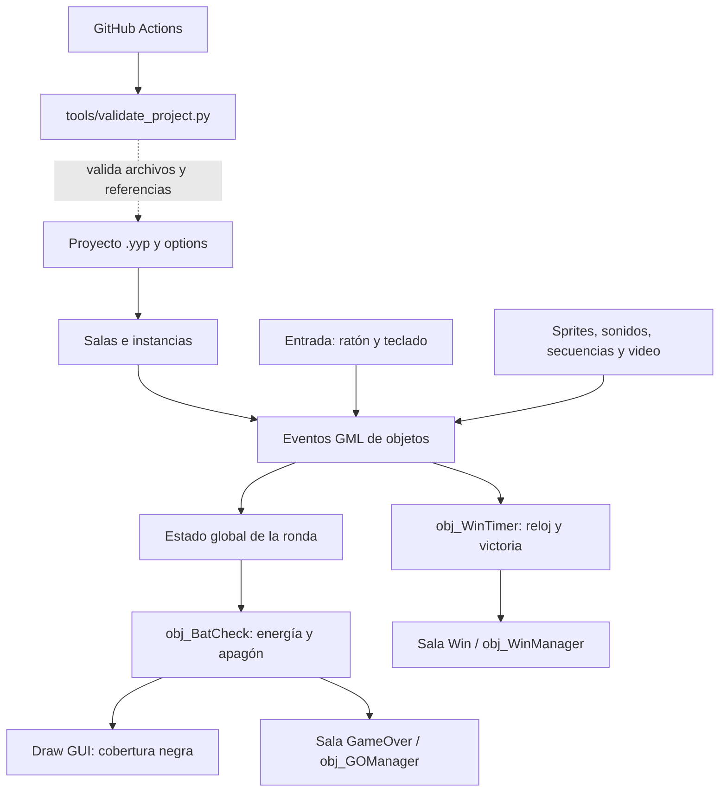

# Estructura y recorrido del código

El proyecto utiliza GameMaker y eventos de objetos escritos en GML. El archivo `Five Nights at ESCOM.yyp` registra los recursos y el orden de salas; la entrada es `MenuPrincipal`.

| Carpeta | Función |
|---|---|
| `objects/` | Eventos y lógica de los objetos |
| `rooms/` | Salas y sus instancias |
| `sprites/`, `sounds/`, `sequences/` | Imágenes, audio y secuencias |
| `datafiles/` | Archivos incluidos, como el video del screamer |
| `options/` | Configuración de los destinos de GameMaker |
| `tools/` | Validador de integridad del proyecto |
| `.github/workflows/` | Comprobaciones automáticas |

La lógica de la ronda y los recursos se ejecutan localmente. La implementación del apagón no utiliza un servidor ni añade dependencias externas.

## Diagrama de arquitectura

Los eventos actualizan el estado y usan los recursos locales para representar la partida. El apagón desactiva las herramientas y detiene la alarma de victoria. CI se ejecuta fuera del juego y revisa los archivos del repositorio.

Autor de la documentación: Alexis Hernandez. Diagrama elaborado con apoyo de IA en la documentación.

## Recorrido del agotamiento

1. `objects/obj_Culturales1/Create_0.gml` inicializa la energía y restablece el estado del apagón.
2. Los objetos de consumo de cámara y láser descuentan energía mientras las herramientas están activas.
3. `objects/obj_BatCheck/Step_2.gml` limita la batería a cero como mínimo, calcula el indicador por rangos y detecta el agotamiento.
4. Al agotarse, ese evento desactiva las herramientas, corrige sus imágenes, detiene el audio y la alarma de victoria e inicia la espera del apagón.
5. `objects/obj_BatCheck/Draw_64.gml` dibuja un rectángulo negro sobre la interfaz. No necesita un sprite de fondo negro.
6. Tras seis segundos de tiempo de juego, el controlador establece `global.JSBy = 1` y cambia a la sala `GameOver`.
7. `obj_GOManager` utiliza el flujo existente para presentar el screamer y después Game Over.

Las guardas de apagón en el controlador de la oficina, el enemigo y el temporizador evitan que otros eventos de la ronda interfieran en esa secuencia.

## Validación

`tools/validate_project.py` comprueba que los recursos declarados existen, que las salas referidas son válidas y que los eventos GML no contienen marcadores de conflicto. El workflow `project-integrity.yml` ejecuta ese script en push y pull request. Esta comprobación no sustituye la compilación ni las pruebas manuales en GameMaker.

Utilicé IA como apoyo en el código y la documentación.
