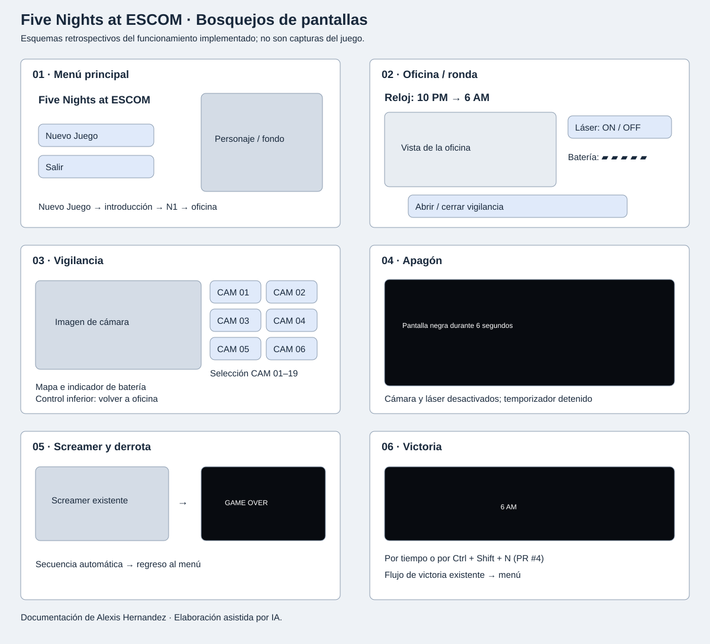
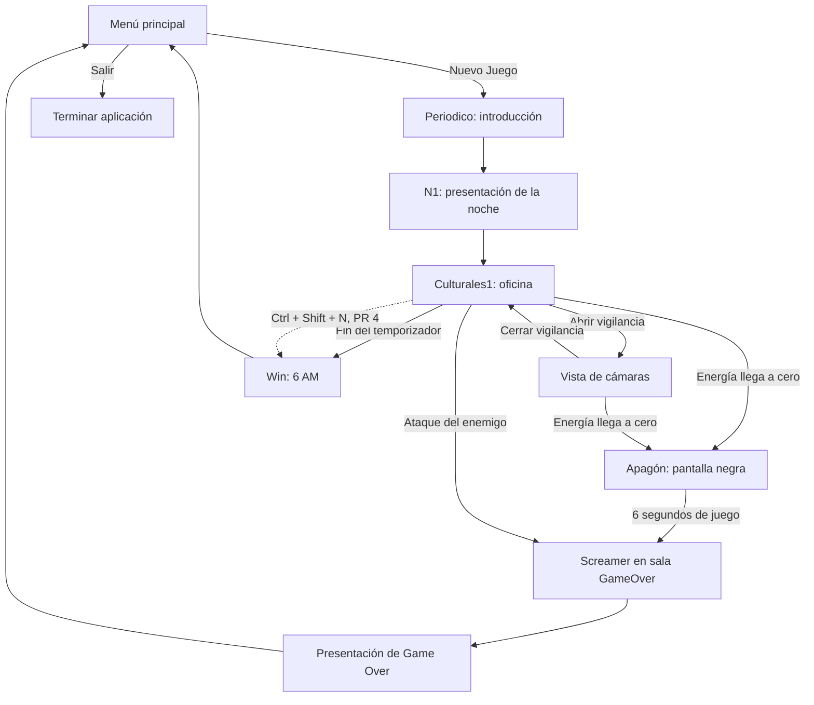

# Bosquejos y flujo del juego

Documenté las pantallas a partir del proyecto y de las capturas de ejecución. Estos bosquejos describen la implementación; no representan una validación previa con usuarios ni sustituyen las evidencias de prueba.

Autor de la documentación: Alexis Hernandez. Utilicé IA como apoyo en el código y la documentación, incluidos estos esquemas.

## Flujo de pantallas

La vigilancia es un cambio de vista durante la ronda; no se representa como una sala independiente. El apagón comienza en la sala de la ronda. El screamer y la presentación de Game Over utilizan la sala `GameOver`. La flecha del atajo corresponde al cambio independiente del PR #4 y requiere energía positiva y ausencia de apagón.

## Controles y reglas

| Acción | Control | Efecto |
|---|---|---|
| Iniciar | Nuevo Juego | Introducción y comienzo de la ronda |
| Vigilar | Control de apertura/cierre | Alterna oficina y cámaras |
| Seleccionar vista | Botones CAM 01–19 | Cambia la cámara observada |
| Defender | Botón del láser | Alterna la defensa mientras hay energía |
| Finalizar ronda con atajo | Ctrl + Shift + N, PR #4 | Activa el flujo de victoria existente |
| Salir | Salir, en el menú | Cierra el juego |

El objetivo es sobrevivir hasta las 6 AM administrando la energía. El agotamiento desactiva las herramientas y termina la ronda con oscuridad, screamer y Game Over.

## Estados de la interfaz

| Estado | Representación y tratamiento |
|---|---|
| Introducción/transición | Pantallas `Periodico` y `N1`; no constituyen una barra de carga |
| Ronda activa | Oficina, reloj, batería y controles |
| Vigilancia activa | Imagen, selección de cámaras, mapa y batería |
| Energía vacía | Indicador a cero, herramientas desactivadas y apagón |
| Valor de energía negativo | El código lo limita a cero y entra al agotamiento; comportamiento identificado en código |
| Derrota | Screamer seguido de Game Over |
| Victoria | Secuencia de 6 AM |
| Sin red | El juego funciona localmente; no se añade un diálogo de conexión |
| Error de carga de recursos | No identifiqué una pantalla específica de recuperación en el flujo revisado |

El juego no presenta formularios de entrada en estas pantallas. Los estados se documentan según su aplicación a una ronda, sin inventar pantallas de formulario, carga o error.
