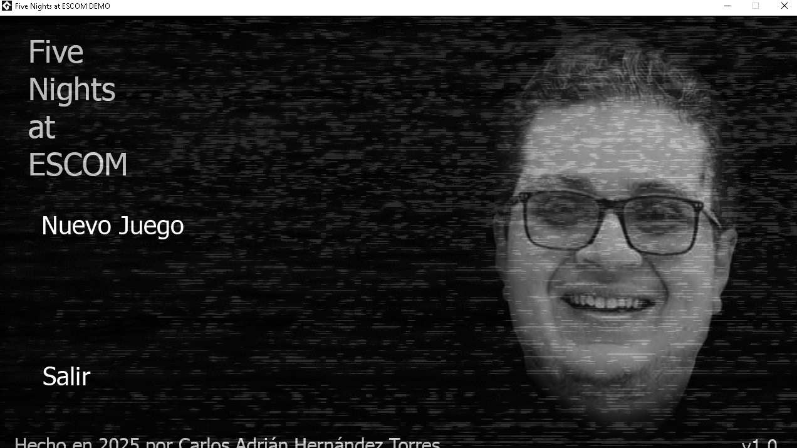
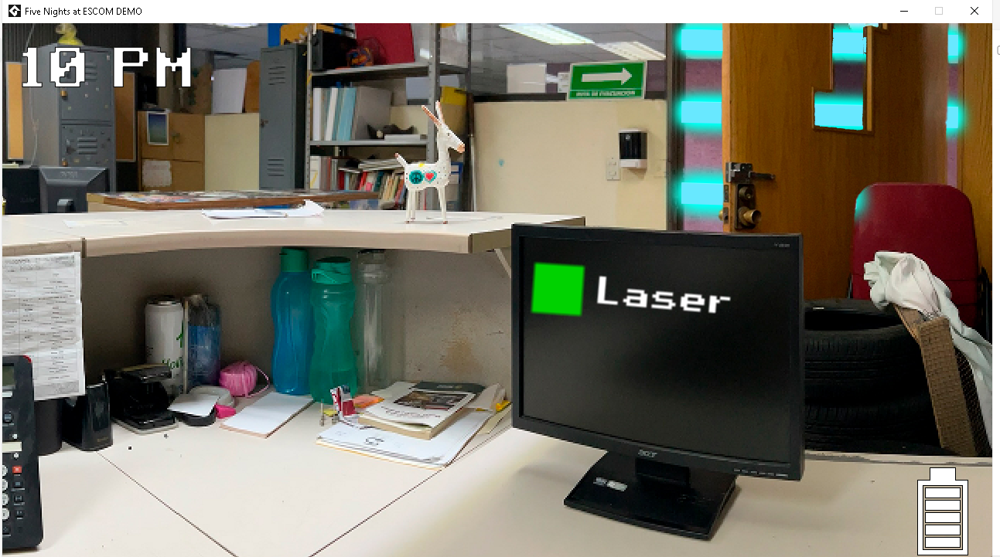
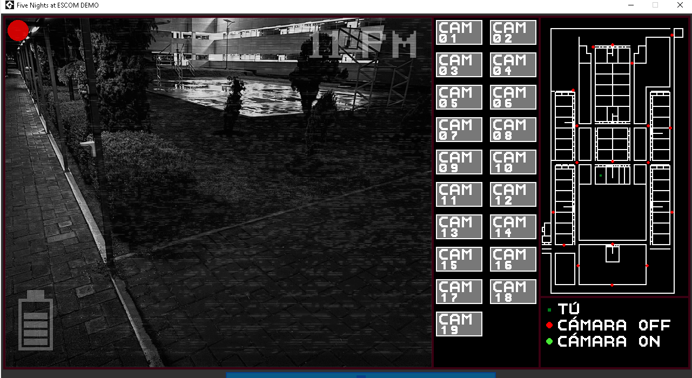
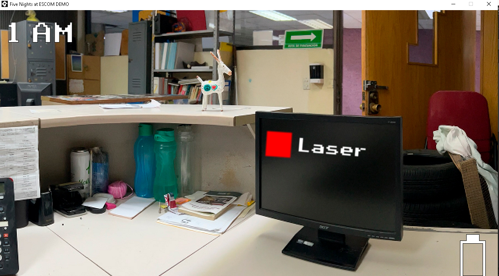

# Evidencias de ejecución

Capturé el funcionamiento del proyecto en Windows el 4 de octubre de 2026. Las imágenes y la grabación corresponden a mi ejecución local (Alexis177).

## Antes del cambio

Menú con las opciones Nuevo Juego y Salir.

Partida a las 10 PM: láser activo e indicador de batería.

Interfaz de vigilancia, selección de cámaras, mapa e indicador de batería.

Al agotarse la batería, la cámara y el láser dejaron de funcionar, pero la partida continuó mostrando la oficina. Comprobé la desactivación de ambas herramientas durante la ejecución.

## Después del cambio

[Grabación del apagón, screamer y Game Over](06-apagon-screamer-gameover.mp4).
En la prueba del cambio comprobé ese orden de presentación al agotarse la batería.

Estas capturas documentan el comportamiento del juego; no incluyen identificación del IDE o de Git en la misma imagen.
